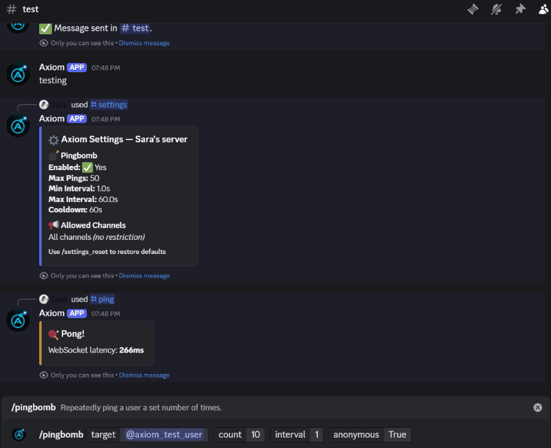
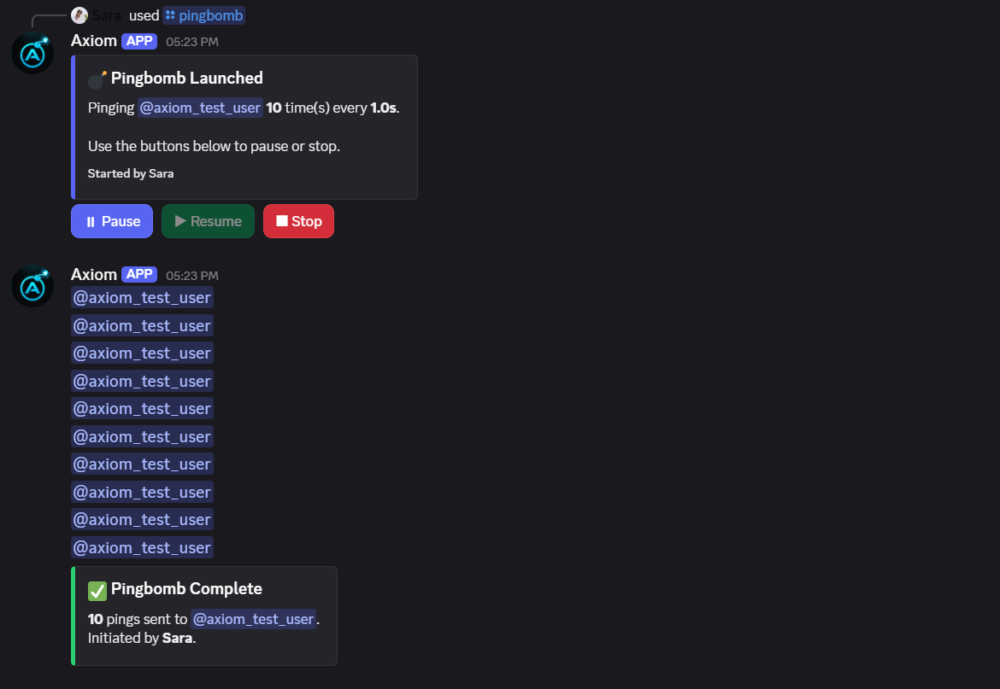
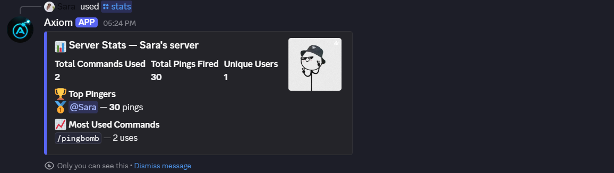
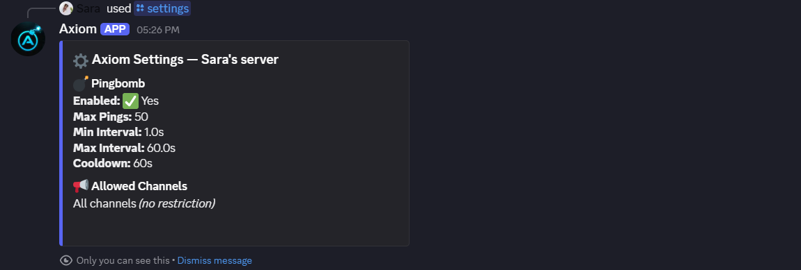

<div align="center">

# Axiom

### A Discord-native operational intelligence system for server infrastructure.

[](https://www.python.org/)
[](https://discordpy.readthedocs.io/)
[](https://github.com/sarawagh27/axiom-bot-python/actions/workflows/tests.yml)
[](#)
[](LICENSE)

</div>

---

## Overview

Axiom is a modular Discord operations system built for servers that want high-control ping utilities, abuse visibility, and production-style intelligence directly inside Discord.

Instead of treating Discord commands as one-off scripts, Axiom models ping activity as managed sessions. Each session has validation, cooldowns, rate limits, pause/stop controls, audit logging, persistent server settings, operational telemetry, anomaly detection, incident tracking, health scoring, and Discord-native operational reports. The result is a bot that feels alive inside the server: aware of recent activity, able to summarize operational state, and ready to surface issues before admins go hunting for them.

The current product direction is Discord-first. Web dashboard and platform expansion have been removed from the active project, while telemetry, anomaly detection, incident lifecycle, operational events, and health scoring remain as reusable internal foundations.

<p align="center">
  
</p>

## Key Features

| Feature | What it does | Why it matters |
|---|---|---|
| Managed pingbomb sessions | Start controlled ping sessions with count, interval, pause, resume, stop, and anonymous mode | Shows async task orchestration and state management |
| Ghost ping tools | Send single or mass ghost pings with limits | Demonstrates Discord API handling and permission-aware behavior |
| Scheduled sessions | Queue a pingbomb for later using human-friendly delays like `30s`, `5m`, or `2h` | Adds real workflow depth beyond simple slash commands |
| Per-server settings | Configure limits, cooldowns, allowed channels, and feature toggles per guild | Makes the bot adaptable for different communities |
| Usage analytics | `/stats` shows server and user activity from SQLite | Gives admins visibility and makes the project stand out |
| Daily server utilities | `/server`, `/userinfo`, `/avatar`, `/poll`, `/remind`, and `/afk` cover common server workflows | Makes Axiom useful even when no incident is happening |
| Moderation actions | `/warn`, `/mute`, `/ban`, and `/purge` provide clean moderation responses with telemetry | Turns admin actions into operational history |
| Discord ops command center | `/ops status`, `/ops incidents`, `/ops report`, and `/ops anomalies` summarize live operational state inside Discord | Makes Axiom feel intelligent and operational where admins already work |
| Operational health scoring | `/ops status` summarizes recent server telemetry, errors, rate limits, active sessions, trend movement, and risk signals | Creates the foundation for server intelligence inside Discord |
| Anomaly detection | `/ops anomalies` detects suspicious sessions, cooldown abuse, command spikes, repeated failures, and explains why each signal matters | Turns raw telemetry into actionable operational intelligence |
| Incident lifecycle | `/ops incidents` opens and lists durable incidents with linked telemetry and signal breakdowns | Gives admins operational memory instead of isolated alerts |
| Proactive anomaly alerts | High-severity anomaly signals can be surfaced automatically in Discord with recommendations | Helps admins notice pressure before they go looking for it |
| Rate limiting | Token bucket protection at user and global levels with retry feedback | Protects the bot from abuse and API pressure |
| Audit logging | Runtime and session events are written to logs | Improves debugging and operational confidence |

## Visual Proof

The screenshots below show Axiom running inside Discord with real slash-command responses, interactive controls, analytics, and server configuration.

| Pingbomb Session | Usage Analytics |
|---|---|
|  |  |

| Server Settings |
|---|
|  |

## Current Product Direction

Axiom is focused on becoming a Discord-native operational intelligence layer. The active project no longer includes a Flask dashboard, dashboard templates, dashboard frontend assets, SSE dashboard streaming, or web health endpoints.

Near-term emphasis:

- intelligent slash commands
- operational summaries inside Discord
- incident reporting and incident memory
- anomaly alerts and health reports
- predictive operational insights
- behavior that feels autonomous, aware, and server-native

Removed from the active scope:

- Flask routes and web server bootstrap
- dashboard templates and frontend assets
- SSE dashboard streaming
- web-specific infrastructure and health endpoints
- multi-tenant web platform work

## Operational Intelligence

Axiom's intelligence layer is built around durable telemetry rather than ad hoc command counters:

- `operational_events` stores structured lifecycle, usage, error, cooldown, rate-limit, and admin activity.
- `core/server_health.py` converts recent telemetry into a guild health score and operational status.
- `core/anomaly_detection.py` detects abnormal ping session activity, cooldown abuse, command spikes, and repeated failures.
- `services/operational_intelligence.py` prepares reusable operational summaries for Discord commands and background alerting.
- `core/incidents.py` turns incident-worthy anomaly signals into durable operational records with linked telemetry.

### Telemetry Pipeline

```text
Discord commands and session engine
        |
        v
usage_stats, audit logs, operational_events
        |
        v
server_health + anomaly_detection + incident lifecycle
        |
        v
Discord /ops commands + proactive anomaly alerts + future analytics exports
```

### Anomaly Detection

The detector is intentionally modular. It consumes SQLite telemetry and emits reusable report objects with severity, thresholds, actor context, command context, and event type. Current signals include:

- abnormal ping session volume
- elevated ping delivery activity
- repeated cooldown hits
- rate-limit pressure
- command usage spikes
- repeated command/runtime failures

## Standout Factor: Smart Rate Limiting

Axiom includes a production-minded rate limiting layer that protects both individual users and the bot as a whole.

Instead of only blocking requests with a generic error, the limiter now estimates when a user can retry and returns clear feedback in Discord. This makes the bot feel more polished and prevents users from guessing whether the bot is broken.

This feature improves the project because it shows real operational thinking:

- Per-user token buckets prevent one member from overwhelming a guild.
- A global token bucket adds another layer of Discord API protection.
- Retry estimates give users actionable feedback instead of vague failure messages.
- Tests cover the async wait behavior so rate limiting does not silently regress.

It fits cleanly into the architecture:

- `core/rate_limiter.py` owns token bucket behavior and retry estimates.
- `cogs/pingbomb.py` uses the limiter during command validation.
- `core/pingbomb_engine.py` uses the limiter inside the async ping loop.
- `tests/test_rate_limiter.py` verifies wait and retry behavior.

## Architecture

Axiom uses a layered structure with clear responsibilities:

```text
axiom-bot-python/
|
|-- bot/                  Discord client, cog loader, global error handler
|-- cogs/                 Slash command modules grouped by feature
|-- core/                 Session state, rate limiting, cooldowns, database, health, anomalies
|-- services/             Audit logging, telemetry, and operational intelligence helpers
|-- ui/                   Discord button views and interaction components
|-- util/                 Shared helpers for permissions and time parsing
|-- scripts/              Operational scripts such as demo telemetry generation
|-- tests/                Unit tests for Discord commands and core behavior
|
|-- main.py               Application entry point with reconnect handling
|-- config.py             Typed environment-based configuration
|-- requirements.txt      Runtime dependencies
```

### Design Highlights

- Cogs are loaded dynamically, so new features can be added without changing the bot bootstrap code.
- Session logic lives in `core/`, keeping command handlers focused on validation and user interaction.
- SQLite handles persistent guild settings and usage statistics without external infrastructure.
- The telemetry layer records operational events once and reuses them for Discord ops commands, proactive alerts, health scoring, anomaly detection, incident lifecycle, and future exports.
- The rate limiter uses token buckets to protect both individual users and bot-wide API usage.

## Command Overview

| Category | Commands |
|---|---|
| Ping sessions | `/pingbomb`, `/pingbomb_status` |
| Ghost pings | `/ghostping`, `/massghost` |
| Scheduling | `/schedule_pingbomb`, `/schedule_list`, `/schedule_cancel` |
| Messaging | `/echo` |
| Analytics | `/stats` |
| Server utilities | `/server`, `/userinfo`, `/avatar` |
| Moderation | `/warn`, `/mute`, `/ban`, `/purge` |
| Community | `/poll`, `/remind`, `/afk` |
| Operations | `/ops status`, `/ops incidents`, `/ops report`, `/ops anomalies`, `/ops_health`, `/ops_anomalies` |
| Server settings | `/settings`, `/settings_set_max_count`, `/settings_set_cooldown`, `/settings_set_min_interval`, `/settings_toggle_pingbomb`, `/settings_add_channel`, `/settings_remove_channel`, `/settings_reset` |
| Admin tools | `/admin_sessions`, `/admin_stop_session`, `/admin_stop_all`, `/admin_clear_cooldown`, `/admin_clear_all_cooldowns` |
| Utility | `/ping`, `/status`, `/info`, `/help` |

## Bot Permissions

| Permission | Why Axiom needs it |
|---|---|
| Send Messages | Sends command responses, ping messages, and completion embeds |
| Manage Messages | Deletes ghost ping messages after notifications fire |
| Embed Links | Displays polished status, settings, and analytics embeds |
| Use Slash Commands | Registers and handles Discord application commands |
| Read Message History | Supports message cleanup and command context |

## Setup

### Prerequisites

- Python 3.11 or newer
- A Discord application and bot token from the [Discord Developer Portal](https://discord.com/developers/applications)

### Install

```bash
git clone https://github.com/sarawagh27/axiom-bot-python.git
cd axiom-bot-python
pip install -r requirements.txt
cp .env.example .env
```

Fill in `.env`, then start the bot:

```bash
python main.py
```

## Environment Variables

| Variable | Required | Default | Description |
|---|---:|---:|---|
| `DISCORD_TOKEN` | Yes | - | Discord bot token |
| `DEV_GUILD_ID` | No | empty | Optional guild ID for instant slash command sync during development |
| `CLEAR_GLOBAL_COMMANDS_ON_DEV_SYNC` | No | `false` | Optional one-time cleanup for stale global commands when using `DEV_GUILD_ID` |
| `PINGBOMB_MAX_COUNT` | No | `50` | Default maximum pings per session |
| `PINGBOMB_MIN_INTERVAL` | No | `1.0` | Minimum seconds between pings |
| `PINGBOMB_MAX_INTERVAL` | No | `60.0` | Maximum seconds between pings |
| `PINGBOMB_COOLDOWN_SECONDS` | No | `60` | Cooldown after a session ends |
| `RATE_LIMIT_TOKENS` | No | `10` | Token bucket capacity per user |
| `RATE_LIMIT_REFILL_RATE` | No | `1.0` | Tokens refilled per second |
| `LOG_LEVEL` | No | `INFO` | Python logging level |
| `LOG_MAX_BYTES` | No | `5242880` | Rotating log file size |
| `LOG_BACKUP_COUNT` | No | `3` | Number of rotated log files to keep |

## Hosting

Axiom now runs as a Discord worker process without an HTTP dashboard or web health endpoints.

| Setting | Value |
|---|---|
| Build command | `pip install -r requirements.txt` |
| Start command | `python main.py` |
| Process type | Background worker |

## Quality Checks

Run the local test suite before pushing changes:

```bash
python -m unittest discover -s tests
```

The same test suite runs in GitHub Actions on every push and pull request.

## Why This Project Is Different

Most Discord bot projects stop at command handlers. Axiom goes further:

- It has a real session lifecycle instead of fire-and-forget command logic.
- It separates Discord UI, business logic, persistence, and operational services.
- It includes rate limiting, cooldowns, permission checks, and admin controls.
- It stores useful analytics and presents them through a polished `/stats` command.
- It records durable operational events that power `/ops status`, `/ops incidents`, `/ops report`, `/ops anomalies`, proactive alerts, adaptive tuning, and future AI-assisted operations.
- It includes a modular anomaly detector that can be reused by background alerting jobs and future exports.

## Future Improvements

- Add incident acknowledge and resolve actions inside Discord.
- Add configurable alert channels and alert quiet hours per guild.
- Add deeper predictive recommendations based on repeated telemetry patterns.
- Add role-based command permissions per guild.
- Export `/stats` data as CSV for server admins.
- Add structured JSON logging for easier production monitoring.
- Add linting and type-checking gates to CI.

Deferred until the Discord-native experience is stronger:

- multi-tenant web platform infrastructure
- deeper cloud observability integrations

## Troubleshooting

If Discord shows duplicate slash commands during development, clear stale global commands once while using `DEV_GUILD_ID`:

```bash
python scripts/clear_global_commands.py
```

Discord can cache slash command changes briefly, so restarting Discord may be needed after cleanup.

### Commit Style

Recommended commit style:

```text
feat: add usage analytics command
fix: prevent rate limiter deadlock
docs: rewrite README for portfolio presentation
test: cover token bucket retry behavior
chore: update gitignore and repository metadata
```

## Author

Built by [Sara Wagh](https://github.com/sarawagh27).

This project is designed as a portfolio-ready example of async Python, Discord bot architecture, stateful command workflows, and production-minded repository presentation.

## License

Released under the [MIT License](LICENSE).
